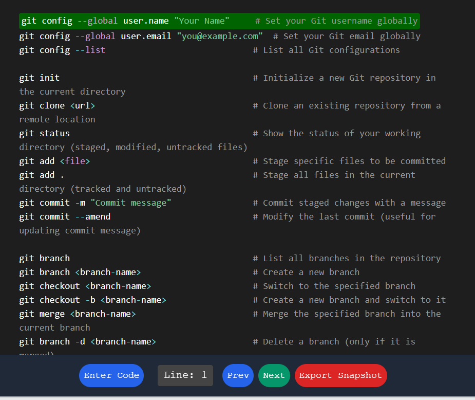
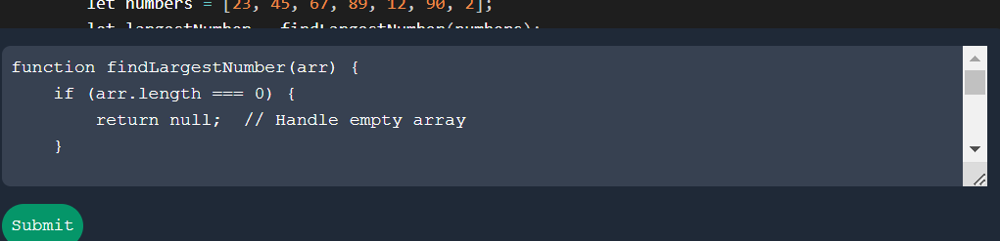
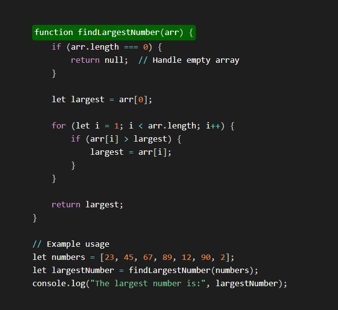
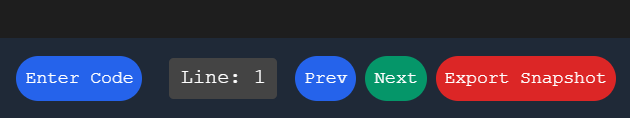
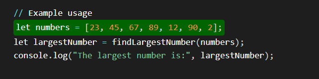
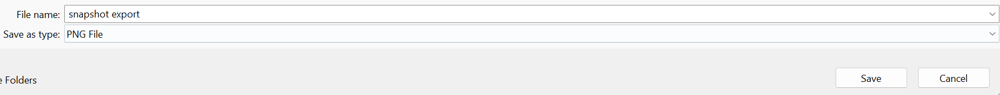

# Code Preview with Navigation and Custom Highlighting

This application allows you to enter Python code, visualize it with syntax highlighting, navigate through the code line by line, and export snapshots of the code.

## Usage Steps

### 1. Enter Code

- Click the "Enter Code" button at the bottom of the page to open the code input box.
- Paste or type your Python code into the textarea provided.
- Click the "Submit" button to submit the code.

### 2. Visualize Code

- After submitting the code, it will be displayed in the code preview area with syntax highlighting.
- The first line of the code will be highlighted by default.

### 3. Navigate Through Code

- Use the "Prev" button to navigate to the previous line of code.
- Use the "Next" button to navigate to the next line of code.
- The current line number is displayed in the "Line: X" indicator.

### 4. Export Snapshot

- Click the "Export Snapshot" button to capture a snapshot of the current code preview.
- The snapshot will be downloaded as a PNG file.

## Features

- **Syntax Highlighting**: The code is displayed with syntax highlighting using Prism.js.
- **Line Navigation**: Easily navigate through the code line by line.
- **Custom Highlighting**: The current line is highlighted with a custom style.
- **Snapshot Export**: Export the code preview as a PNG image.

## Notes

- The application is designed to work with Python code.
- The browser zoom is set to 100% when capturing snapshots to ensure consistent image quality.

Enjoy coding and visualizing!